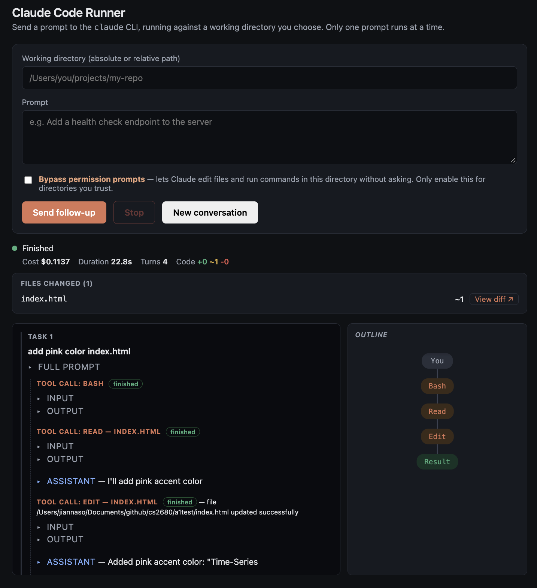

# 1: What we built

The frontend of this tool takes a directory and prompt, provides them to Claude, and visualizes the turns it takes to fulfill the prompt. Once the directory and prompt are submitted, the trajectory is shown in real-time, including whether turns are successful or fail. Tool inputs and outputs are displayed in collapsed text, though errors are shown upfront. Additional prompts can be sent to continue the same session. The run's numbers, incluging cost, dollars, and turns, are displayed when the run finishes. On the right, the trajectory is visualized as a tree. Additionally functionality includes a diff list and access to diff files displayed in the browser, as well as clickable pills on the trajectory tree to check specific events during the run. 

# 2: What I learned

1) I was surprised how long the agent took for different tasks. For example, it seemed to take much longer to add matching pill-text colors between the left and right modules compared to generating a new diff component that displayed files in-browser. This hinted to me that generating a new component is much less taxing than fixing an old one.

2) A pitfall of this process was being unfamiliar with the completely generated code. I honestly have never used Claude to completely generate code from scratch, and so I did not know the structure of the code at all. For example, there were nested collapsed text boxes in the frontend, but it would have been more labor at that point to check where the text boxes were and collapse them myself. I would tell other people who want to be more intentional and aware of their code to check the code structure, or ask for high-level code description, as the process goes along. 

3) A lesson I learned was that functionality is most important to establish before styling. For example, I was trying to style the left module before the content was correct (ex: different font styles or colors before the text content was finalized), which led to a bit of confusing and seemingly inefficient back-and-forth turns on my end. Next time, I will scope my planning to start more function-focused, and batch my future requests in terms of style, content, and further functionality.

# 3: One thing I would change

As I mentioned, I am not used to generating code entirely through genAI. I felt very distanced and absent from my code, so I wish that Claude could help me maintain that feeling of agency I usually feel. I wish I had more insight into how the code and modules were structured. For example, certain lines or files were listed as being changed, but I wish the changes were spatially associated to the front end changes. 